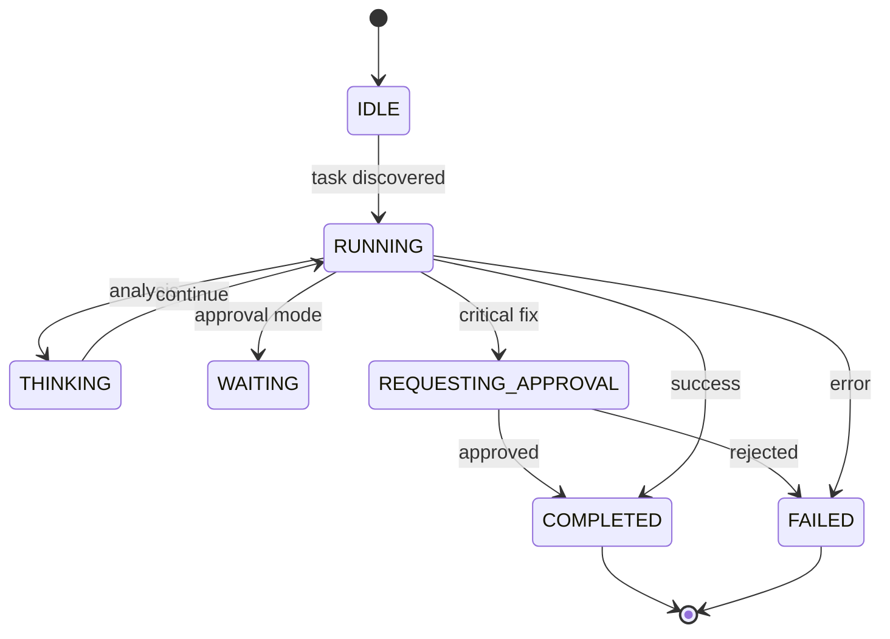
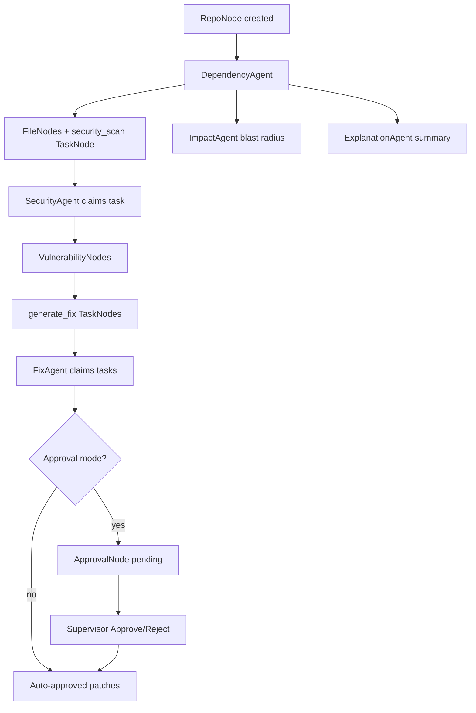

# Agent Interaction Flow — RepoSense

## Agent Lifecycle



## Task Propagation Flow



## Graph Traversal Behavior

| Agent | Discovers work via | Creates |
|-------|-------------------|---------|
| DependencyAgent | `RepoNode` entry | `FileNode`, `TaskNode(security_scan)` |
| SecurityAgent | `pending_tasks(security_scan)` | `VulnerabilityNode`, `TaskNode(generate_fix)` |
| ImpactAgent | dependency graph | impact report on session |
| ExplanationAgent | repo analysis complete | summary, recommendations |
| FixAgent | `pending_tasks(generate_fix)` | `ApprovalNode`, patches |
| MonitorAgent | mission start/end | orchestration logs |

## Approval Workflow

1. FixAgent generates patch for high/medium finding
2. Creates `ApprovalNode` linked via `approval_request` edge
3. State → `REQUESTING_APPROVAL`
4. Frontend shows Agent Decision Console
5. `POST /approve` updates graph session
6. FixAgent → `COMPLETED`

## Autonomous Coordination Examples

```
[DependencyAgent] discovered 83 Python files
[SecurityAgent] identified insecure subprocess usage
[ImpactAgent] changing auth affects: Login, Billing, Session
[FixAgent] generated secure replacement patch
[ExplanationAgent] repo type: Flask Backend API
```

## Live Streaming

Frontend connects: `GET /stream/<session_id>` (EventSource)

Events:

- `log` — terminal execution stream
- `state` — agents, graph, findings, github metadata, summary
- `done` — mission complete

No mock data path—all events originate from real clone + scan + GitHub API + heuristics/LLM.
